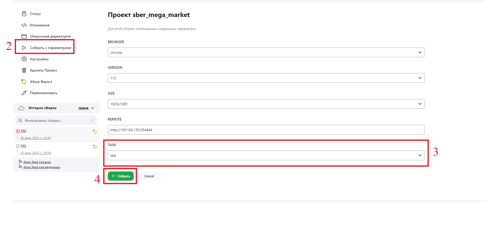

# sber_mega_market
<h1 >Проект по автоматизации тестирования для <a href="https://sbermegamarket.ru/">SberMegaMarket</a></h1>

## Содержание

* <a href="#description">Описание</a>
* <a href="#tools">Технологии и инструменты</a>
* <a href="#cases">Реализованные проверки</a>
* <a href="#console">Запуск тестов из терминала</a>
* <a href="#jenkins">Запуск тестов в Jenkins</a>
* <a href="#allure">Отчеты в Allure</a>
* <a href="#telegram">Уведомления в Telegram с использованием бота</a>
* <a href="#selenoidvideo">Пример прогона теста в Selenoid</a>

<a id="description"></a>

## Описание

Данный проект состоит из автоматизированных:

* UI-тестов для веб-приложения [sbermegamarket.ru](https://sbermegamarket.ru)

<a id="tools"></a>

## Технологии и инструменты

<p align="center">


</p>

Автотесты написаны на <code>Java</code> с использованием <code>JUnit 5</code> и <code>Gradle</code>, применены различные
библиотеки и фреймворки.

Также реализована сборка в <code>Jenkins</code> с формированием Allure-отчета и отправкой уведомления с результатами
в <code>Telegram</code> после завершения прогона.
В качестве системы управления тестированием выбран <code>Allure TestOps</code>.

Allure-отчет включает в себя:

* шаги выполнения тестов;
* скриншот страницы в браузере в момент окончания автотеста;
* Page Source;
* логи браузерной консоли;
* видео выполнения автотеста.

### Для UI-тестов

* при написании использован фреймворк [Selenide](https://selenide.org/)
* запуск осуществляется локально или с помощью [Selenoid](https://aerokube.com/selenoid/).

<a id="cases"></a>

## Реализованные проверки

### Автоматизированные проверки UI

- [ ] Проверка поиска товара
- [ ] Проверка очистки строки поиска
- [ ] Проверка присутствиея на главной странице названия логотипа
- [ ] Проверка добавления товара в корзину

### Мануальные проверки

- [ ] Фильтрация товара в расширенном фильтре

<a id="console"></a>

## Запуск тестов

### Локальный запуск тестов

#### Для UI-тестов

```
gradle clean test_ui -Denv=local
```

<a id="jenkins"></a>

## Запуск тестов в [Jenkins](http://109.106.139.39:7080/job/sber_mega_market/)

1. Для запуска тестов необходимо перейти по адрессу http://109.106.139.39:7080/job/sber_mega_market/.
2. Для запуска сборки необходимо перейти в раздел **Собрать с параметрами**
3. Запуская ui-тесты, необходимо указать параметры для сборки (путем выбора из списка или прямым указанием значения) и
   в <code>TASK</code> выбрать test_ui.
4. Нажать кнопку **Собрать**.

<p align="center">
</a>
</p>

<a id="allure"></a>

## Отчеты в [Allure Report](http://109.106.139.39:7080/job/sber_mega_market/49/allure/)

### Прохождение UI-тестов

<p align="center">

</p>

## Уведомления в Telegram с использованием бота

### Уведомление о прохождении UI-тестов

<p align="center">

</p>

## Пример прогона UI-теста в Selenoid

К каждому тесту в отчете прилагается видео.
<p align="center">
  
</p>

